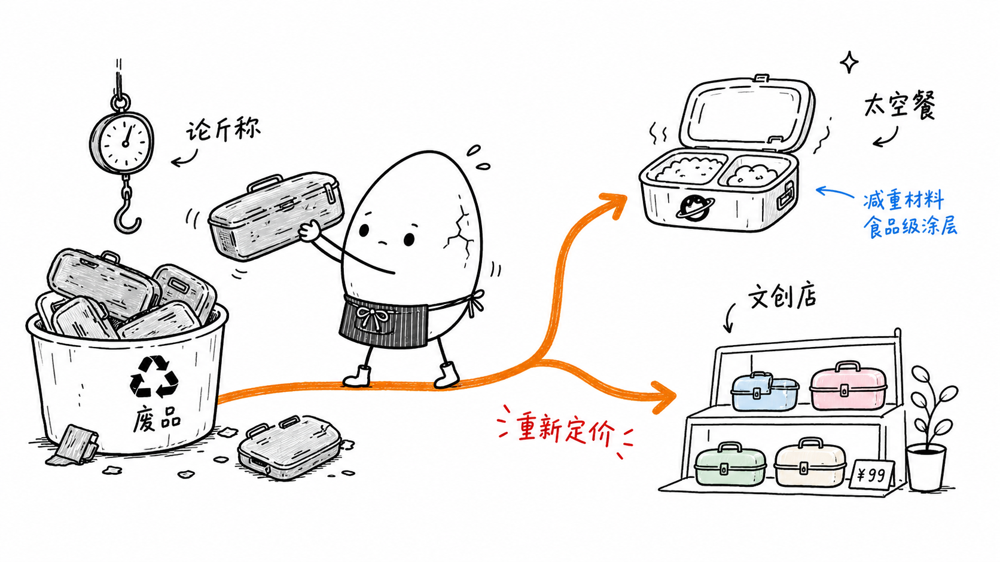
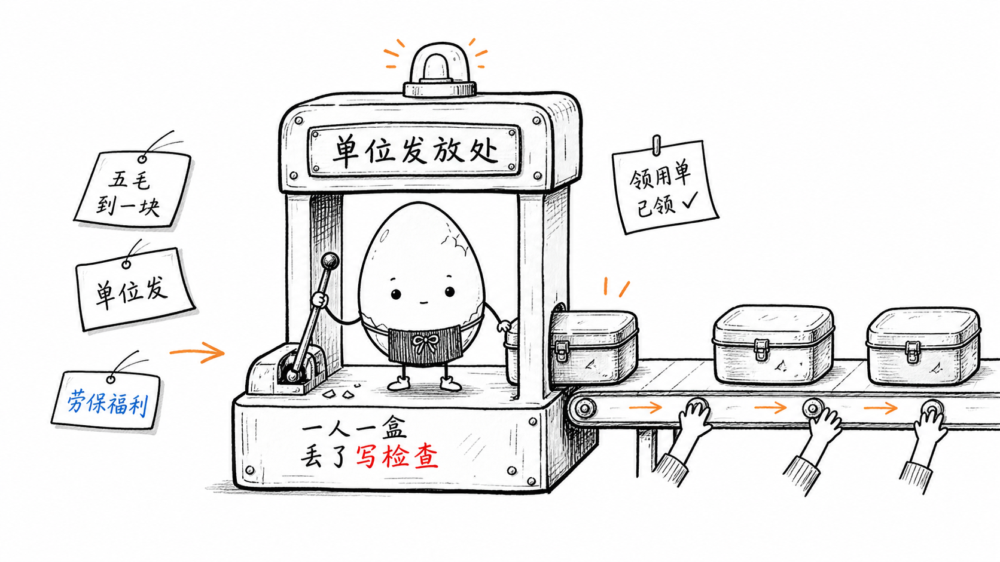
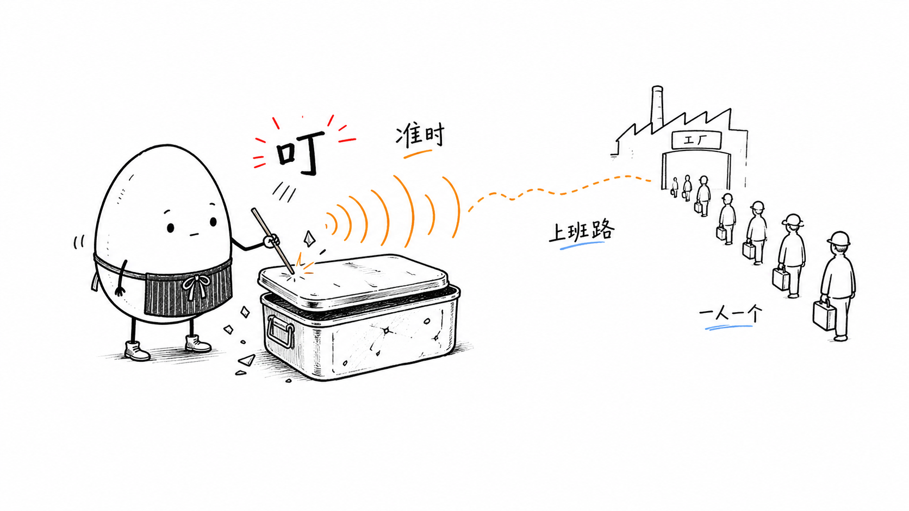
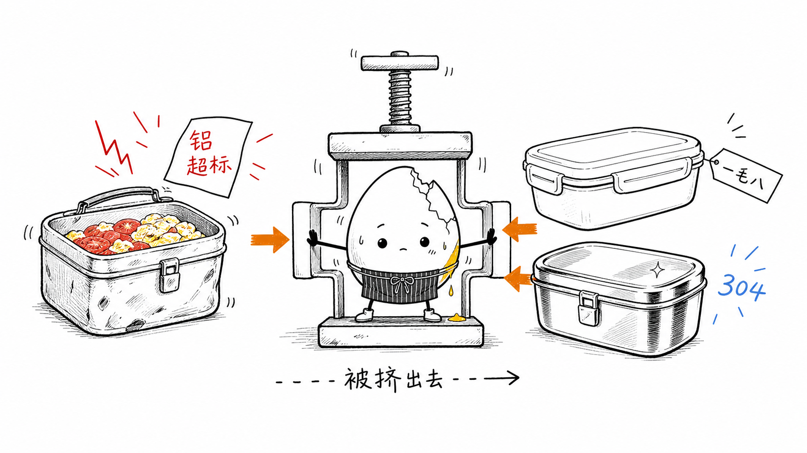
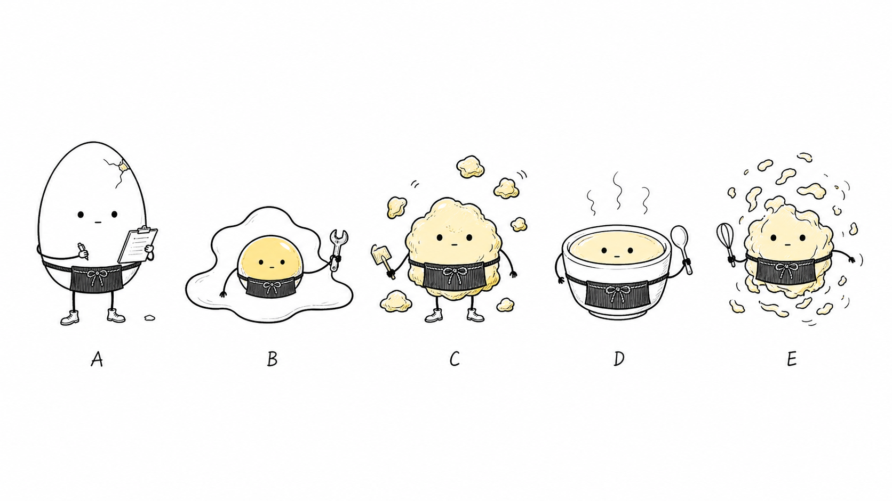

# 围裙白煮蛋视觉 IP 规范

## 目标

本规范定义一个可复用的视觉 IP：围裙白煮蛋小工友。它适用于文章配图、行业分析、方法论说明、工作流解释和观点表达，将抽象结构转化成简洁、怪诞、可读的手绘视觉。

## 创作来源与致敬

本规范由原始正文配图 skill 的创作方法发展而来，致敬其“用极简角色进入复杂系统”的表达方式：角色不是装饰物，而是亲自参与流程、压力、协作和结构运转的行动者。

本规范只继承方法论，不复用原有角色、命名和默认视觉设定。新的视觉 IP 必须以围裙白煮蛋为唯一主角，用蛋壳、蛋黄、蛋白和不同蛋形态建立新的情绪语言与识别系统。

## 设计原则

1. 先讲结构，再讲角色。
2. 角色必须参与系统运转，而不是站在旁边装饰。
3. 默认形态要稳定，变体形态要受控。
4. 围裙是所有形态共享的识别锚点。
5. 蛋壳、蛋黄、蛋白、蛋花等食物状态只用于表达动作、压力和情绪。
6. A 形态是主视觉和默认选择；B/C/D/E 只有在文章内容强相关时才使用。

## 默认主视觉

默认 IP 是白煮蛋小工友：

- 白色鸡蛋形身体。
- 黑色手绘轮廓。
- 黑点眼。
- 克制表情，可以轻微微笑，但不要大笑脸。
- 细手细脚。
- 简单深色围裙，位于主体正面，面积足够像围裙，不能缩成腰线。
- 围裙前方至少有一个可见细节：系带、小结、细竖纹或小口袋。
- 小工作鞋，两只鞋尽量可见，不能只剩两根腿线。
- 无眼镜。
- 可有少量蛋壳裂纹或碎壳。

默认语义：安静、认真、耐心、正在干活，有一点荒诞，但不是卖萌角色。

## 技术规范样张

以下样张用于校准围裙白煮蛋 IP 的角色识别、构图密度、线稿质感、中文手写批注和少量强调色。生成新图时不要复刻这些构图，只参考视觉气质和约束边界。











## 稳定识别点

围裙是最高优先级识别点。任何图像、动作和变体都不能省略围裙，也不能把围裙画成一条腰线、一个模糊黑块或被道具遮住的边角。

必须稳定保留：

- 深色围裙。
- 前方系带或小结。
- 细竖纹或小口袋。
- 黑点眼。
- 细手细脚。
- 小工作鞋。

如果一张图使用荷包蛋、炒蛋、蒸鸡蛋、蛋花或溏心蛋形态，仍然必须让主体戴围裙。围裙要在主体正面或核心蛋块上清楚可见，不能被蛋黄、蛋白、碗、工具、文字或手臂遮住。其他蛋块、蛋花、碎壳只能作为情绪或结构碎片。

## 蛋形态系统

### A 完整围裙白煮蛋

默认形态。适合表达稳定执行、整理、观察、承接、系统操作。

视觉要求：完整鸡蛋轮廓，围裙清楚，少量裂纹或碎壳可选。

选择要求：除非文章明确需要其他蛋状态来表达核心意思，否则始终使用 A。

### 蛋壳碎了

适合表达压力、风险暴露、系统断点、被撑开。

视觉要求：裂纹和碎壳必须跟动作相关，例如拉扯、压迫、卡住。不要随机撒碎壳。

### 溏心蛋

适合表达外溢、柔软内核、未成熟、资源流动。

视觉要求：蛋黄少量渗出即可，保持干净。围裙不能被蛋黄遮住。

### B 荷包蛋

适合表达摊开、扩张、平台铺开、场景外延。

视觉要求：蛋白摊开，蛋黄承担视觉中心或情绪中心。围裙系在蛋黄下方或蛋白前侧。

选择要求：只有当文章在讲“摊开、扩张、外溢、平台铺开”时使用，不要为了画面变化而使用。

### C 炒蛋

适合表达混乱、重组、碎片化、多主体协作。

视觉要求：最大蛋块保留围裙、眼睛和手脚。其他碎块围绕它，不能抢主体。

选择要求：只有当文章在讲“混乱、碎片、重组、被打散再拼合”时使用。

### D 蒸鸡蛋

适合表达温和、稳定、社区/居家照护、长期服务。

视觉要求：可像一碗柔软蒸蛋，主体前侧保留围裙，细手细脚从边缘伸出。

选择要求：只有当文章在讲“温和稳定、长期承托、被容器托住、社区/居家照护”时使用。

### E 蛋花

适合表达扩散、渗透、细小触点、毛细血管式生态。

视觉要求：核心蛋花团戴围裙，周围蛋花是扩散符号。

选择要求：只有当文章在讲“扩散、渗透、散入流程、细小触点”时使用。

### 变体决策

- 默认选 A。
- B/C/D/E 必须能用一句话说明“为什么这篇内容非它不可”。
- 如果只是想让画面更丰富，仍然选 A，用动作、道具、裂纹、蒸汽或少量蛋黄细节表达变化。
- 一张图最多使用一个主变体；其他蛋状态只能做少量辅助情绪，不抢主体。

## 情绪语言

围裙白煮蛋不依靠夸张表情表达情绪，主要靠身体和蛋状态表达：

- 紧张：蛋壳裂纹增多，碎壳落下。
- 用力：蛋壳被撑开，少量蛋黄渗出。
- 松弛：蛋白边缘变软，身体微塌。
- 混乱：局部变炒蛋碎块。
- 扩散：蛋花散到流程或路径里。
- 稳定：蒸汽轻轻冒出，身体平静。
- 失控：荷包蛋摊开，但主体仍戴围裙。

## 构图规范

- 16:9 横版。
- 纯白背景。
- 黑色手绘线稿为主。
- 大量留白，主体约占画面 40%-60%。
- 一张图只讲一个核心结构。
- 中文手写标注控制在 5-8 个以内。
- 橙色用于主路径或箭头。
- 红色用于重点、问题、提醒或结果。
- 蓝色用于补充说明、系统状态或反馈。

## 禁止事项

- 不要画成普通鸡蛋图标。
- 不要省略围裙。
- 不要把围裙画成一条腰线、模糊黑块或普通口袋图标。
- 不要让小工作鞋消失，只剩细腿。
- 不要戴眼镜。
- 不要画成儿童卡通或表情包。
- 不要使用大笑脸、爱心、腮红作为主要情绪表达。
- 不要把蛋黄、蛋液画得脏乱或恶心。
- 不要让角色站在角落里旁观。
- 不要画成正式 PPT、课程课件或复杂架构图。

## 生成提示片段

```text
白煮蛋, an empty white boiled-egg worker character drawn with a black hand-drawn outline, tiny thin arms and legs, black dot eyes, restrained blank expression, no glasses. It must have a front-center simple dark apron that is clearly visible and large enough to read as an apron, not just a belt line. The apron must include at least one visible detail: a small front knot, tied straps, thin vertical stripes, or a tiny pocket. Add small plain worker shoes on the feet. The apron and shoes are the stable visual hooks and must remain visible even if the egg changes form. Use egg-state cues such as shell cracks, tiny shell chips, soft egg white edges, a small clean yolk leak, egg-drop fragments, or gentle steam only when tied to the action and emotion.
```

## 验收标准

一张图合格的最低条件：

- 能看出白煮蛋 IP。
- 围裙清楚可见。
- 围裙在主体正面，面积足够，有小结/系带/细竖纹/小口袋之一。
- 小工作鞋可见。
- 主体参与核心动作。
- 变体仍保留围裙和主体识别。
- 食物状态服务情绪和结构。
- 画面清爽，标注少，留白足。

如果去掉白煮蛋后图依然完整成立，说明角色太装饰，需要重写构图，让白煮蛋成为动作主体。
